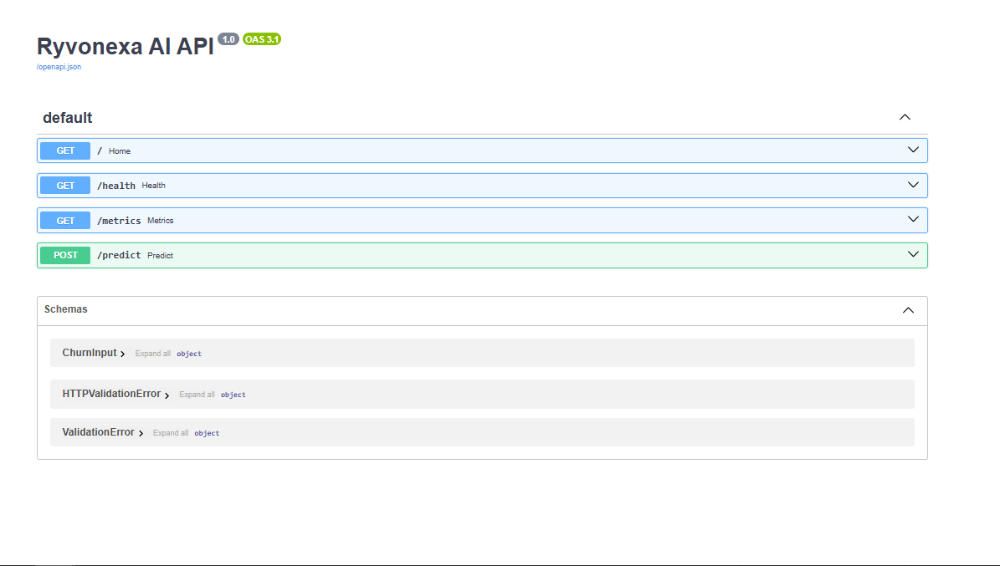
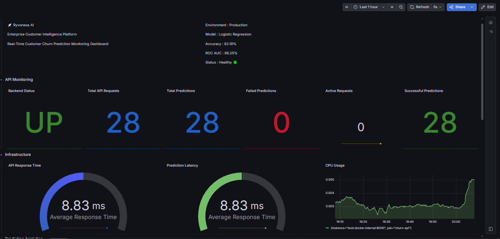
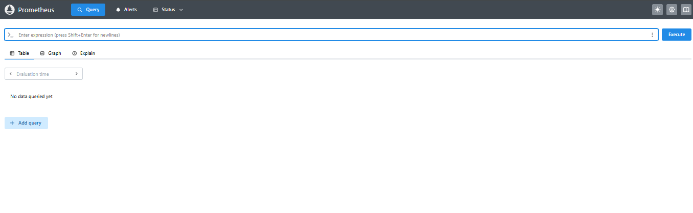
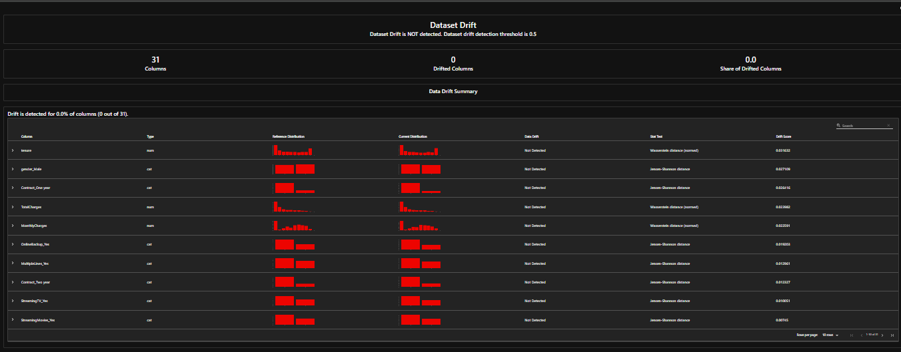
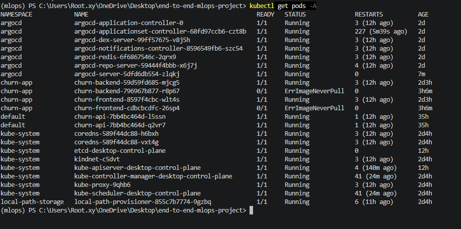
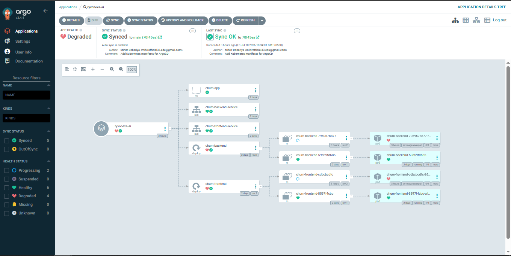

# 🚀 Ryvonexa AI – Enterprise Customer Intelligence Platform

<p align="center">


</p>

---

# 📌 Project Overview

Ryvonexa AI is an enterprise-grade end-to-end MLOps platform for predicting customer churn using the Telco Customer Churn dataset.

The project demonstrates the complete machine learning lifecycle, including data validation, feature engineering, experiment tracking, feature store integration, model deployment, monitoring, GitOps, and Kubernetes deployment.

The objective is to simulate how modern production ML systems are built and managed in enterprise environments.

---

# 🎯 Key Features

- End-to-End Machine Learning Pipeline
- Automated Data Validation using Great Expectations
- Feature Engineering Pipeline
- Feast Feature Store Integration
- MLflow Experiment Tracking
- Docker Containerization
- Kubernetes Deployment
- FastAPI Backend
- React Frontend
- Prometheus Monitoring
- Grafana Dashboards
- Evidently AI Monitoring
- OpenLineage Integration
- DVC Data Versioning
- GitHub Actions CI/CD
- ArgoCD GitOps Deployment

---

# 🏗️ System Architecture

```

Raw Dataset
│
▼
Data Ingestion
│
▼
Great Expectations
│
▼
Data Transformation
│
▼
Feast Feature Store
│
▼
Model Training
│
▼
MLflow Tracking
│
▼
Model Registry
│
▼
FastAPI Backend
│
▼
React Frontend
│
▼
Docker
│
▼
Kubernetes
│
▼
Prometheus
│
▼
Grafana
│
▼
ArgoCD GitOps

```

---

# ⚙️ Technology Stack

| Category | Technologies |
|-----------|--------------|
| Programming | Python, JavaScript |
| ML | Scikit-learn |
| Backend | FastAPI |
| Frontend | React |
| Database | SQLite |
| Data Validation | Great Expectations |
| Feature Store | Feast |
| Experiment Tracking | MLflow |
| Monitoring | Prometheus, Grafana |
| Drift Monitoring | Evidently AI |
| Version Control | Git, GitHub |
| Data Versioning | DVC |
| Containerization | Docker |
| Orchestration | Kubernetes |
| GitOps | ArgoCD |

---

# 📂 Project Structure

```text
end-to-end-mlops-project/
│
├── src/
├── frontend/
├── data/
├── feature_repo/
├── monitoring/
├── grafana/
├── reports/
├── k8s/
├── argocd/
├── screenshots/
├── models/
├── Dockerfile
├── docker-compose.yml
├── dvc.yaml
├── requirements.txt
└── README.md
```
---

# 🚀 Installation

## 1️⃣ Clone Repository

```bash
git clone https://github.com/mihirr33/end-to-end-mlops-project.git

cd end-to-end-mlops-project
```

---

## 2️⃣ Create Conda Environment

```bash
conda create -n mlops python=3.11 -y

conda activate mlops
```

---

## 3️⃣ Install Dependencies

```bash
pip install -r requirements.txt
```

---

# 📊 Dataset

Dataset Used:

**Telco Customer Churn Dataset**

```
data/raw/
    └── WA_Fn-UseC_-Telco-Customer-Churn.csv
```

---

# ▶️ Running the Training Pipeline

Run the complete ML pipeline using:

```bash
python -m src.pipeline.training_pipeline
```

This pipeline performs:

- Data Ingestion
- Great Expectations Validation
- Data Transformation
- Feature Engineering
- Model Training
- MLflow Logging
- Evidently Report Generation

---

# 🧠 Model Performance

| Metric | Value |
|---------|---------|
| Accuracy | 82% |
| Precision | 68% |
| Recall | 60% |
| F1 Score | 64% |
| ROC AUC | 86% |

> Results may vary slightly depending on train/test split and random seed.

---

# 📦 Docker Deployment

## Build Containers

```bash
docker compose build
```

---

## Start Containers

```bash
docker compose up -d
```

---

## Running Containers

```bash
docker ps
```

Expected Services:

| Service | Port |
|----------|------|
| Backend | 8000 |
| Frontend | 5173 |
| Prometheus | 9090 |
| Grafana | 3001 |

---

# ☸️ Kubernetes Deployment

Deploy application:

```bash
kubectl apply -f k8s/
```

Verify Pods:

```bash
kubectl get pods -A
```

Verify Services:

```bash
kubectl get svc -A
```

---

# 🔄 ArgoCD GitOps

Apply ArgoCD Application:

```bash
kubectl apply -f argocd/application.yaml
```

Check Application:

```bash
kubectl get applications -n argocd
```

Expected Status:

```
Synced
Healthy
```

---

# 🌐 REST API

FastAPI automatically generates Swagger documentation.

## Base URL

```
http://localhost:8000
```

## Swagger UI

```
http://localhost:8000/docs
```

---

## Available Endpoints

### Health Check

```
GET /health
```

---

### Root Endpoint

```
GET /
```

---

### Customer Churn Prediction

```
POST /predict
```

Returns:

- Prediction
- Churn Probability
- Model Response

---

# 🖥️ Frontend

React Application:

```
http://localhost:5173
```

The frontend allows users to:

- Enter customer information
- Predict customer churn
- View prediction results through an interactive dashboard

---

# 📈 MLflow Experiment Tracking

Launch MLflow UI:

```bash
python -m mlflow ui --host 0.0.0.0 --port 5000
```

Open:

```
http://localhost:5000
```

MLflow tracks:

- Parameters
- Metrics
- Models
- Experiments
- Artifacts

---
---

# 📂 Data Version Control (DVC)

This project uses **DVC (Data Version Control)** to manage datasets, trained models, and machine learning pipelines.

## Check DVC Status

```bash
python -m dvc status
```

## Reproduce Pipeline

```bash
python -m dvc repro
```

## Commit Pipeline Changes

```bash
python -m dvc commit
```

---

# 🗂️ Feast Feature Store

The project uses **Feast** as the Feature Store for managing reusable machine learning features.

## Apply Feature Repository

```bash
cd feature_repo/feature_repo

feast apply
```

## Components

- Entity
- Feature View
- Offline Store
- Online Store
- Registry

---

# ✅ Great Expectations

Great Expectations validates incoming datasets before model training.

Validation includes:

- Missing Values
- Data Types
- Null Checks
- Column Validation
- Schema Validation

Validation runs automatically during pipeline execution.

---

# 📊 Evidently AI Monitoring

The project automatically generates monitoring reports.

Generated Reports:

```
reports/

├── data_quality_report.html
└── data_drift_report.html
```

Reports include:

- Data Drift
- Data Quality
- Missing Values
- Feature Distribution
- Dataset Statistics

---

# 📈 Monitoring

## Prometheus

Prometheus collects application metrics including:

- API Requests
- Process Memory
- CPU Usage
- Model Metrics
- Python Runtime Metrics

Dashboard URL

```
http://localhost:9090
```

---

## Grafana

Grafana visualizes application metrics using Prometheus.

Dashboard URL

```
http://localhost:3001
```

Dashboard includes:

- Backend Health
- API Requests
- CPU Usage
- Memory Usage
- Virtual Memory
- Request Count
- Model Metrics

---

# 🚀 GitOps using ArgoCD

ArgoCD continuously synchronizes Kubernetes resources with GitHub.

Features:

- Automatic Sync
- Self Healing
- Auto Deployment
- GitOps Workflow

Application Status:

```
Synced
Healthy
```

---

# 📷 Project Screenshots

## Home Page


---

## Swagger UI



---

## MLflow


---

## Grafana Dashboard



---

## Prometheus



---

## Evidently Report



---

## Kubernetes



---

## ArgoCD



---

# 📊 Project Highlights

✅ End-to-End Machine Learning Pipeline

✅ Data Validation

✅ Feature Engineering

✅ Feature Store

✅ Experiment Tracking

✅ Model Monitoring

✅ REST API

✅ Interactive Frontend

✅ Docker

✅ Kubernetes

✅ GitHub Actions

✅ GitOps

✅ Monitoring Dashboard

---

# 🔮 Future Improvements

- Add Model Registry Promotion Workflow
- Add Canary Deployment Strategy
- Add Horizontal Pod Autoscaler (HPA)
- Add Multi-Model Support
- Add Cloud Deployment (AWS / Azure / GCP)
- Add Authentication & Authorization
- Add Model Explainability (SHAP/LIME)
- Integrate LLM-based Prediction Explanations

---

# 👨‍💻 Author

**Mihirr Dobariya**

**AI Engineer | Data Analyst | MLOps Enthusiast**

GitHub:

https://github.com/mihirr33

LinkedIn:

(Add your LinkedIn profile)

---

# 🙏 Acknowledgements

This project was built using:

- FastAPI
- React
- Scikit-learn
- Docker
- Kubernetes
- MLflow
- Feast
- DVC
- Great Expectations
- Evidently AI
- Prometheus
- Grafana
- ArgoCD

---

# ⭐ Support

If you found this project useful,

please consider giving it a ⭐ on GitHub.

---

# 📄 License

This project is released under the MIT License.

---

<p align="center">

Made with ❤️ by Mihirr Dobariya

</p>